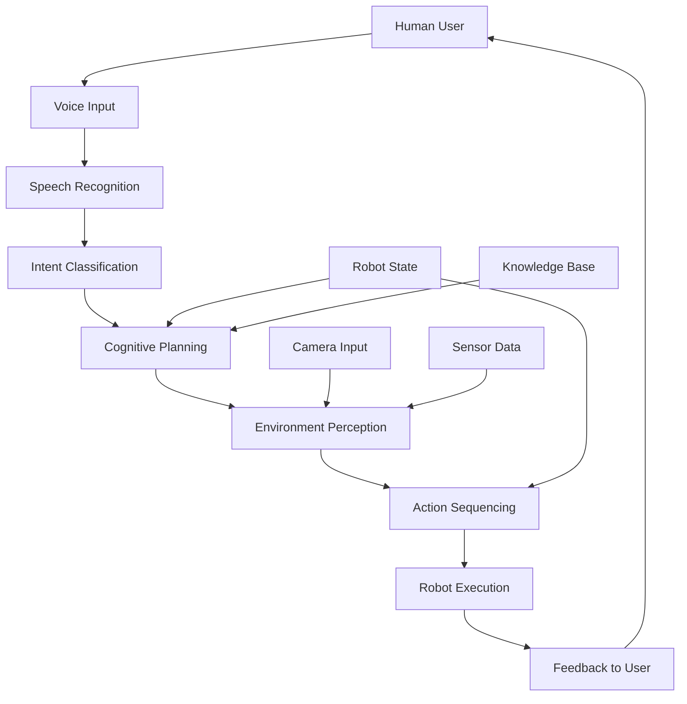
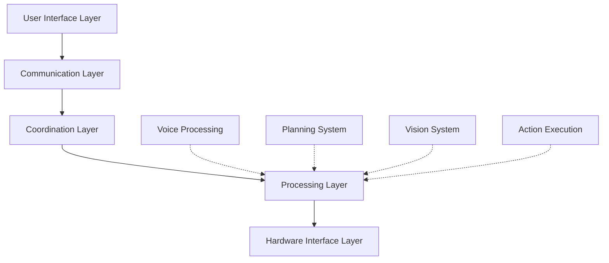
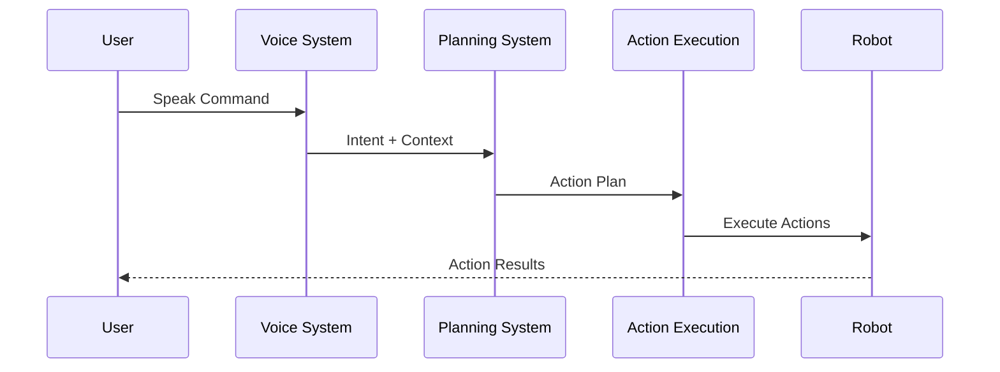
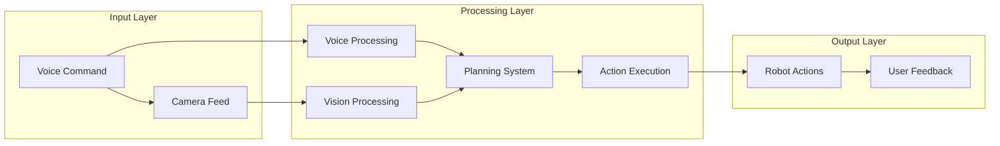

# Complete VLA System Architecture Diagrams

## End-to-End VLA System Architecture

```mermaid
graph TB
    A[Human User] --> B[Voice Input]
    B --> C[Speech Recognition]
    C --> D[Intent Classification]
    D --> E[Cognitive Planning]
    E --> F[Environment Perception]
    F --> G[Action Sequencing]
    G --> H[Robot Execution]
    H --> I[Feedback to User]
    I --> A

    J[Camera Input] --> F
    K[Sensor Data] --> F
    L[Robot State] --> E
    L --> G
    M[Knowledge Base] --> E
```

## Multi-Layer System Architecture

```mermaid
graph TD
    A[User Interface Layer] --> B[Communication Layer]
    B --> C[Coordination Layer]
    C --> D[Processing Layer]
    D --> E[Hardware Interface Layer]

    D1[Voice Processing] -.-> D
    D2[Planning System] -.-> D
    D3[Vision System] -.-> D
    D4[Action Execution] -.-> D
```

## Voice-to-Action Pipeline

```mermaid
sequenceDiagram
    participant User
    participant Voice as Voice System
    participant Planning as Planning System
    participant Execution as Action Execution
    participant Robot

    User->>Voice: Speak Command
    Voice->>Planning: Intent + Context
    Planning->>Execution: Action Plan
    Execution->>Robot: Execute Actions
    Robot-->>User: Action Results
```

## System Integration Flow

```mermaid
flowchart LR
    subgraph "Input Layer"
        A[Voice Command] --> B[Camera Feed]
    end

    subgraph "Processing Layer"
        C[Voice Processing]
        D[Vision Processing]
        E[Planning System]
        F[Action Execution]
    end

    subgraph "Output Layer"
        G[Robot Actions]
        H[User Feedback]
    end

    A --> C
    B --> D
    C --> E
    D --> E
    E --> F
    F --> G
    G --> H
```