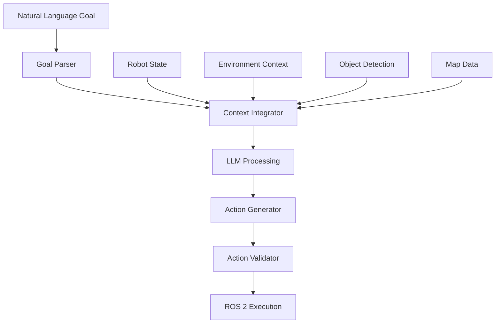
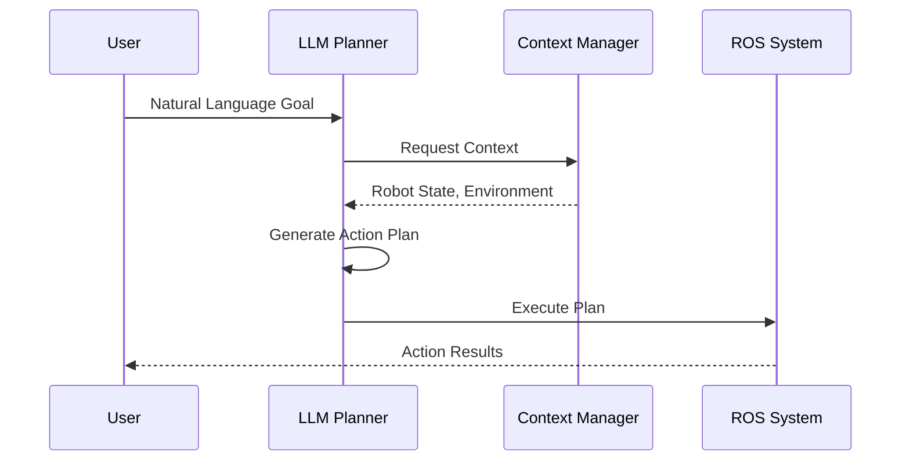
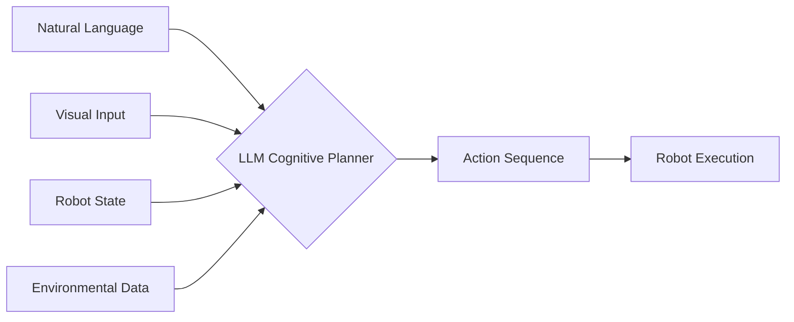

# LLM Cognitive Planning Architecture Diagrams

## Cognitive Planning Pipeline Architecture

```mermaid
graph TD
    A[Natural Language Goal] --> B[Goal Parser]
    B --> C[Context Integrator]
    C --> D[LLM Processing]
    D --> E[Action Generator]
    E --> F[Action Validator]
    F --> G[ROS 2 Execution]

    H[Robot State] --> C
    I[Environment Context] --> C
    J[Object Detection] --> C
    K[Map Data] --> C
```

## LLM-Based Planning Process

```mermaid
sequenceDiagram
    participant User
    participant LLM Planner
    participant Context Manager
    participant ROS System

    User->>LLM Planner: Natural Language Goal
    LLM Planner->>Context Manager: Request Context
    Context Manager-->>LLM Planner: Robot State, Environment
    LLM Planner->>LLM Planner: Generate Action Plan
    LLM Planner->>ROS System: Execute Plan
    ROS System-->>User: Action Results
```

## Multi-Modal Integration

```mermaid
graph LR
    A[Natural Language] --> B{LLM Cognitive Planner}
    C[Visual Input] --> B
    D[Robot State] --> B
    E[Environmental Data] --> B
    B --> F[Action Sequence]
    F --> G[Robot Execution]
```