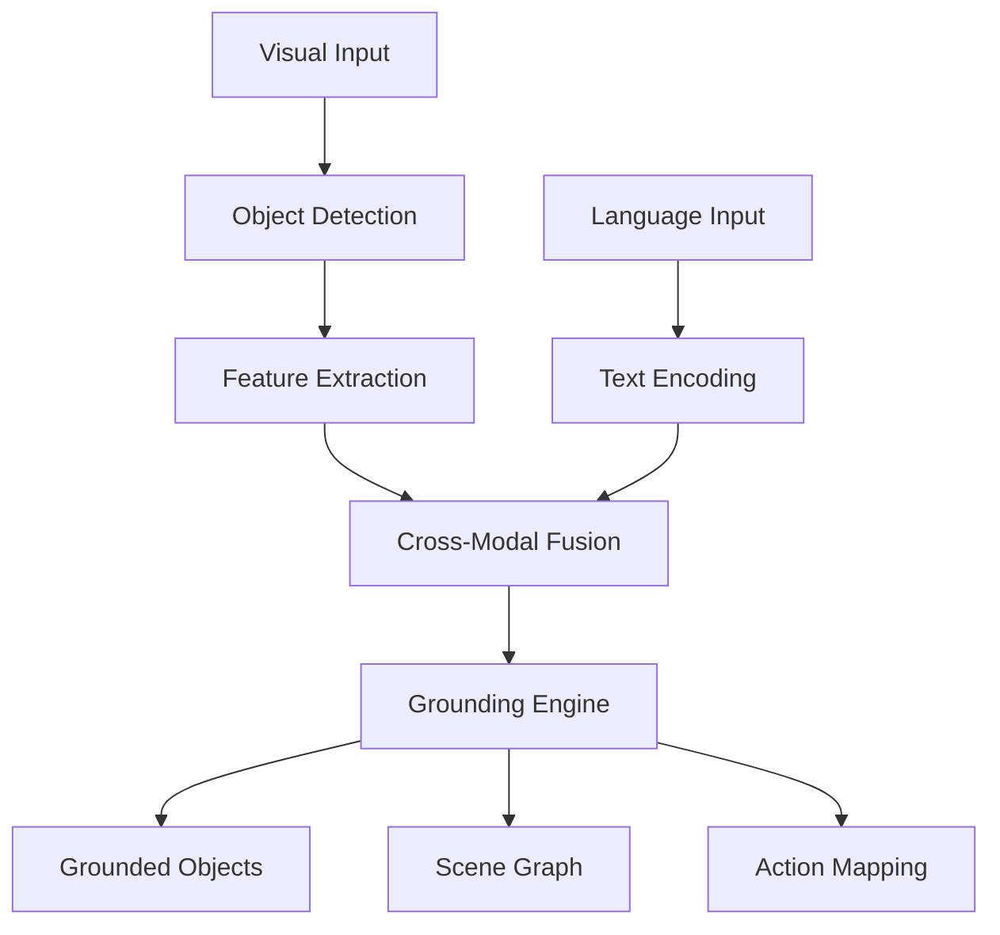
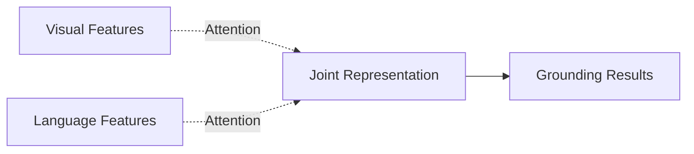
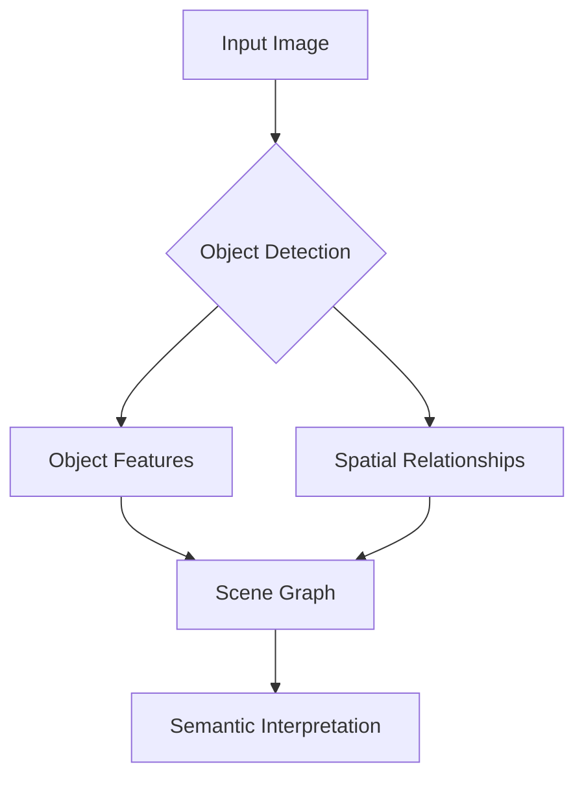
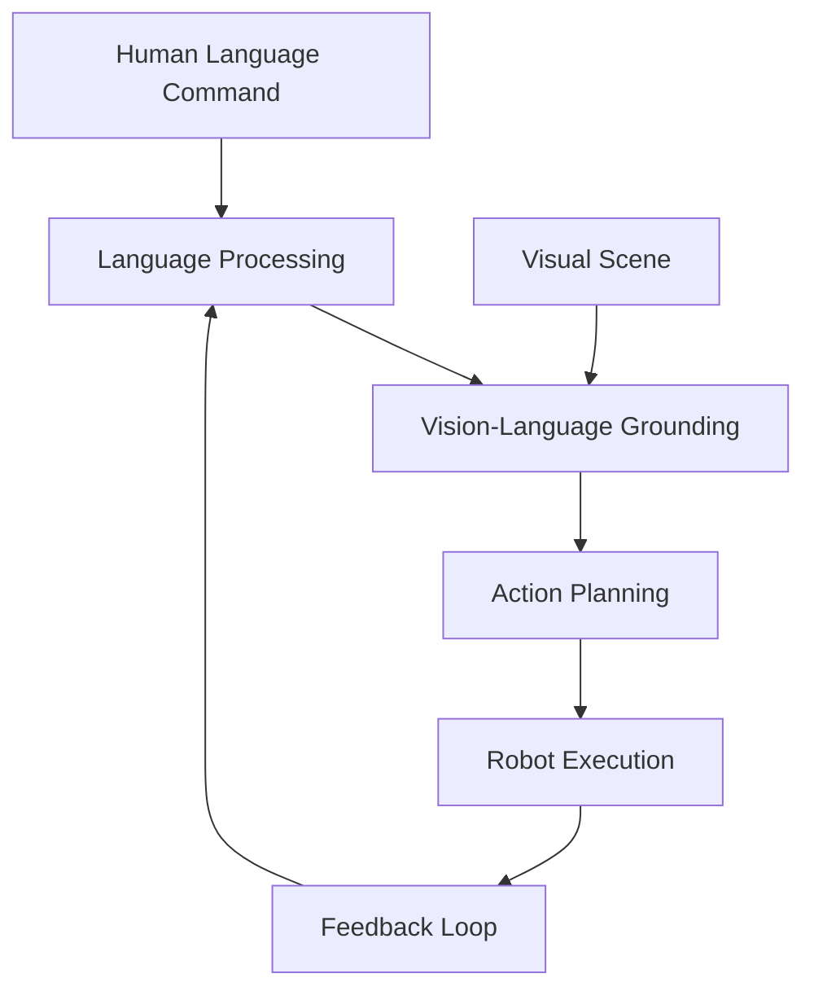

# Vision-Language Integration Architecture Diagrams

## Vision-Language Grounding Pipeline

## Cross-Modal Attention Mechanism

## Scene Understanding Process

## Vision-Language Integration in VLA System

