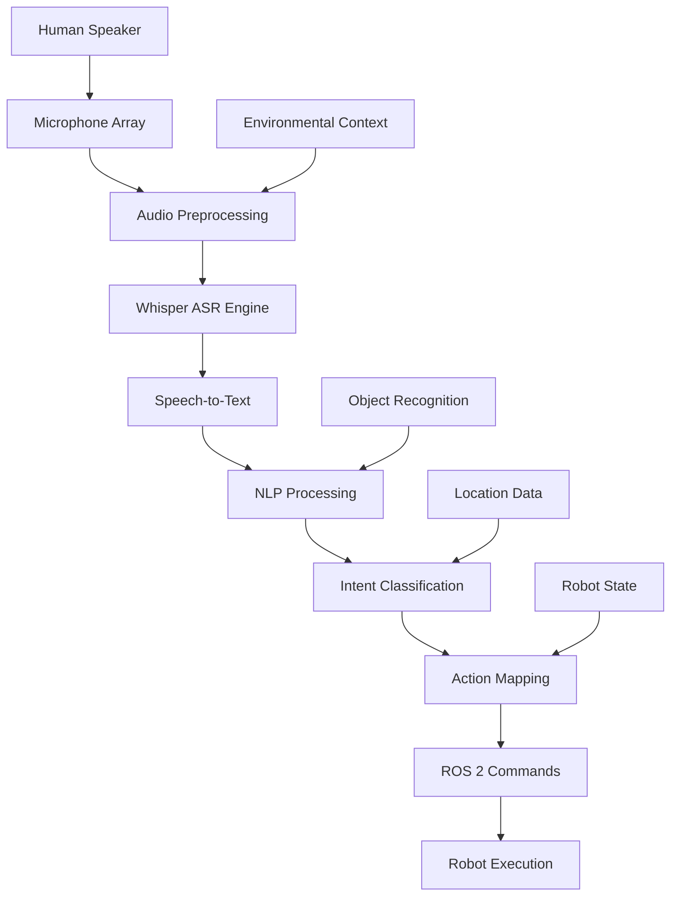
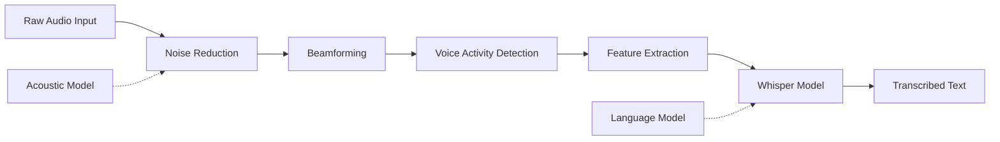
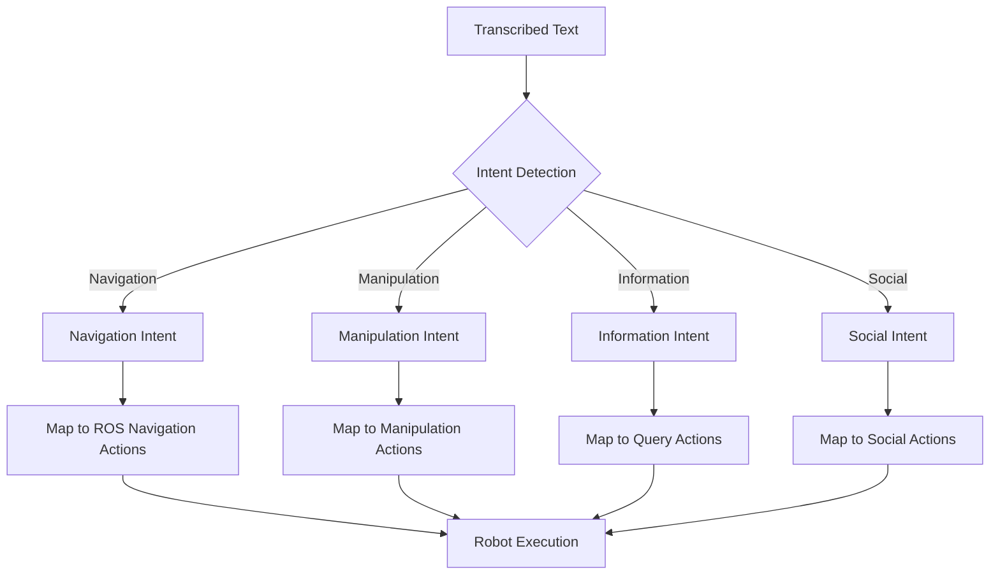
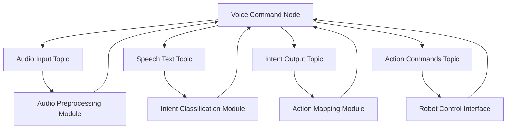

# Voice Recognition Architecture Diagrams

## Voice-to-Action Pipeline Architecture

```mermaid
graph TD
    A[Human Speaker] --> B[Microphone Array]
    B --> C[Audio Preprocessing]
    C --> D[Whisper ASR Engine]
    D --> E[Speech-to-Text]
    E --> F[NLP Processing]
    F --> G[Intent Classification]
    G --> H[Action Mapping]
    H --> I[ROS 2 Commands]
    I --> J[Robot Execution]

    K[Environmental Context] --> C
    L[Robot State] --> H
    M[Object Recognition] --> F
    N[Location Data] --> G
```

## Audio Processing Pipeline

```mermaid
graph LR
    A[Raw Audio Input] --> B[Noise Reduction]
    B --> C[Beamforming]
    C --> D[Voice Activity Detection]
    D --> E[Feature Extraction]
    E --> F[Whisper Model]
    F --> G[Transcribed Text]

    H[Acoustic Model] -.-> B
    I[Language Model] -.-> F
```

## Intent Classification Flow

```mermaid
graph TD
    A[Transcribed Text] --> B{Intent Detection}
    B -->|Navigation| C[Navigation Intent]
    B -->|Manipulation| D[Manipulation Intent]
    B -->|Information| E[Information Intent]
    B -->|Social| F[Social Intent]

    C --> G[Map to ROS Navigation Actions]
    D --> H[Map to Manipulation Actions]
    E --> I[Map to Query Actions]
    F --> J[Map to Social Actions]

    G --> K[Robot Execution]
    H --> K
    I --> K
    J --> K
```

## ROS 2 Integration Architecture

```mermaid
graph TB
    A[Voice Command Node] --> B[Audio Input Topic]
    A --> C[Speech Text Topic]
    A --> D[Intent Output Topic]
    A --> E[Action Commands Topic]

    B --> F[Audio Preprocessing Module]
    C --> G[Intent Classification Module]
    D --> H[Action Mapping Module]
    E --> I[Robot Control Interface]

    F --> A
    G --> A
    H --> A
    I --> A
```